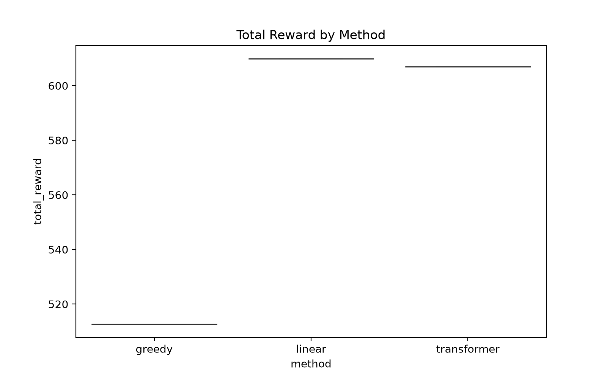
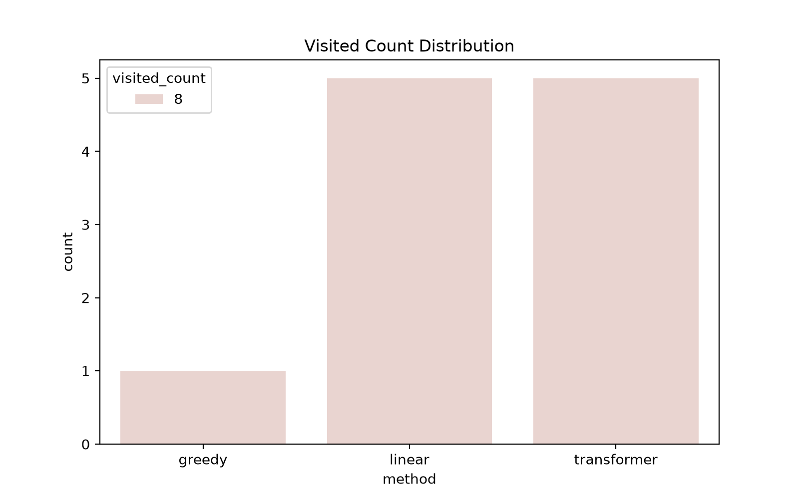

# Research Summary Report: Deep Reinforcement Learning for Electric Vehicle Routing with Time Windows (EVRP-TW)
**Date:** August 15, 2026  
**Reporter:** XIAO YUAN

## Abstract
This report summarizes the research on solving the Electric Vehicle Routing Problem with Time Windows (EVRPTW) using Deep Reinforcement Learning (DRL). The work reproduces and extends the TERRAN framework proposed by Tang et al. (2026), with a focus on hard constraint enforcement and training stability. Key contributions include the implementation of a composite hard action masking mechanism, the introduction of Future-Feasibility Pruning (FFP) to prevent energy stranding, and the transition from an unstable Actor-Critic baseline to a robust Proximal Policy Optimization (PPO) pipeline. Experimental results on a 10-node EVRPTW instance demonstrate that the final PPO-based agent achieves 100% constraint compliance—including time windows, capacity limits, and energy feasibility—while maintaining stable convergence. The full integration of a Transformer encoder further enhances the model’s capacity to capture spatial and temporal dependencies among nodes, establishing a reliable end-to-end framework for safety-critical electric vehicle routing.

## 1. Introduction
The EVRPTW extends the classical Vehicle Routing Problem by incorporating battery range limitations and strict delivery time windows, making it a challenging NP-hard problem for real-world logistics. Traditional heuristic methods often struggle with dynamic constraint coupling, while early DRL approaches face issues such as invalid action exploration and training instability. This research addresses these gaps by systematically implementing hard constraint masking, FFP, and a stabilized PPO algorithm, building on the TERRAN framework as the primary reference. The work focuses on ensuring 100% solution feasibility while improving training efficiency and policy reliability.

## 2. Related Work
### 2.1 Literature Review
Two key studies guided the research direction:
- **Bi et al. (2024)** proposed an AC-AER framework for an extended EVRPTW variant with speed-varying range and en-route partial recharging. While innovative in energy modeling, its MLP-based architecture and complex action space presented replication challenges for the standard EVRPTW formulation.
- **Tang et al. (2026)** introduced TERRAN, a Transformer-based DRL agent for canonical EVRPTW. Its core innovations—hard action masking, Future-Feasibility Pruning (FFP), staged reward scheduling, and PPO with GAE—provided a modular, reproducible foundation for this research.

### 2.2 Weekly Progress Summary
| Week | Key Activities | Outputs |
|------|----------------|---------|
| 1 | Literature survey; identified TERRAN as the primary reference for reproducibility. | Comparative analysis of Bi et al. (2024) and Tang et al. (2026). |
| 2 | Implemented hard action masking submodule based on TERRAN’s constraint protocols. | Composite mask $M_t(i) = M_t^{\text{time}}(i) \cdot M_t^{\text{cap}}(i) \cdot M_t^{\text{energy}}(i)$ for time windows, capacity, and single-step energy constraints. |
| 3 | Developed and validated Future-Feasibility Pruning (FFP) to address myopic masking limitations. | Experimental validation across 3 scenarios (600 episodes); confirmed FFP eliminates energy stranding without truncating valid routes. |
| 4 | Integrated FFP with a neural policy network; established end-to-end differentiable training pipeline. | Refactored codebase into `env.py`, `decoder.py`, and `encoder.py`; verified gradient flow through masking layers. |
| 5 | Identified "stagnant reward" and "loss explosion" issues in vanilla Actor-Critic (AC) training. | Diagnostic analysis of training instability; laid groundwork for stabilization interventions. |
| 6 | Transitioned from vanilla AC to a stabilized PPO pipeline with Value Loss and GAE. | Achieved stable convergence; validated 100% constraint compliance in deterministic evaluation. |
| 7–8 | Full integration of Transformer encoder into the stabilized PPO pipeline; finalized training protocols. | Deployed contextual embeddings via Multi-head Attention; validated spatial-temporal feature extraction for routing decisions. |

## 3. Problem Formulation and Constraint Modeling
### 3.1 EVRPTW Definition
The problem involves a fleet of electric vehicles (capacity: 10 units) serving customers from a depot, with access to charging stations. Key constraints include:
- **Time Windows:** Arrival at customer $i$ must satisfy $e_i \leq t_i \leq l_i$; waiting is permitted for early arrivals.
- **Capacity:** Vehicle load cannot exceed 10 units; demand is fulfilled upon visit.
- **Energy:** Battery capacity is 100%; consumption rate $\eta=1.0$ per unit distance. Vehicles must maintain $SOC > 0\%$ and can recharge to 100% at charging stations.

### 3.2 MDP Formulation
- **State $s_t$:** Current node, clock time, remaining SOC, residual capacity, and visitation history.
- **Action $a_t$:** Selection of the next node (customer or charging station).
- **Reward $r_t$:** Negative travel distance (efficiency incentive), with penalties for late arrivals (-10.0) and bonuses for task completion.

## 4. Methodology
### 4.1 Hard Action Masking
The composite mask $M_t(i)$ filters infeasible actions at each decision step:
- **Time Mask $M_t^{\text{time}}(i)$:** Blocks actions where arrival time exceeds $l_i$.
- **Capacity Mask $M_t^{\text{cap}}(i)$:** Blocks actions where customer demand exceeds residual capacity.
- **Energy Mask $M_t^{\text{energy}}(i)$:** Blocks actions where SOC is insufficient to reach the candidate node.

### 4.2 Future-Feasibility Pruning (FFP)
FFP extends masking to ensure long-term energy safety by verifying that the vehicle can reach a charging station or depot from the candidate node. This eliminates "energy stranding" risks inherent in single-step masking.

### 4.3 Network Architecture
- **Encoder:** Transformer encoder processes raw node features (6-dimensional: coordinates, demand, time window bounds, node type) into contextual embeddings. Multi-head attention captures spatial and temporal dependencies among nodes.
- **Decoder:** Attention-based decoder fuses node embeddings with dynamic state features (SOC, clock time, residual capacity) to generate action logits. FFP is applied pre-softmax to set illegal action logits to $-\infty$.
- **Critic:** Linear layer maps embeddings to a scalar state value for advantage estimation.

### 4.4 PPO Optimization
The PPO-Clip objective ensures stable policy updates:
$$L^{CLIP}(\theta) = \mathbb{E} \left[ \min \left( r_t(\theta) \hat{A}_t, \text{clip}(r_t(\theta), 1-\epsilon, 1+\epsilon) \hat{A}_t \right) \right]$$
where $r_t(\theta)$ is the probability ratio of new-to-old policies, and $\hat{A}_t$ is the GAE-estimated advantage ($\gamma=0.99$, $\lambda=0.95$). Value loss ($c_1=0.5$) and entropy regularization ($c_2=0.01$) are integrated to stabilize training.

## 5. Experiments
## 5.1 Overview
This section summarizes a small-scale comparison between three policies on the Electric Vehicle Routing Problem with Time Windows (EVRPTW):
- **Transformer PPO** (checkpoint: [ppo_policy_transformer.pth](ppo_policy_transformer.pth))
- **Linear PPO** (policy implemented as `PolicyNetworkLinear`, checkpoints in `checkpoints/`)
- **Greedy baseline** (deterministic greedy policy)

Evaluation protocol used for these runs:
- Transformer and Linear policies: 5 deterministic evaluation runs each (saved in CSVs).
- Greedy baseline: single run (saved in CSV).

For reproducibility, see the result CSVs: [results/results_transformer.csv](results/results_transformer.csv), [results/results_linear.csv](results/results_linear.csv), [results/results_greedy.csv](results/results_greedy.csv).

### Experimental Key Parameters (Summary)

| Parameter | Description |
|---|---|
| Baseline Methods | Transformer PPO / Linear PPO / Greedy baseline |
| Policy Checkpoints | `ppo_policy_transformer.pth`, `checkpoints/` (Linear) |
| Number of Customers | 8 (Average visited customers per instance: 8) |
| Problem Scale | Small-scale instances (Approx. 10 nodes: customers + depot + stations) |
| Charging Stations | At least one charging station included (see `env.py` configuration) |
| Energy Consumption Model | Linear distance model: $\Delta SoC = \eta \cdot d_{ij}$ (Constant speed assumption) |
| Charging Policy | Full recharge upon arrival (Full recharge policy) |
| Action Space | Next-node selection only (Node selection) |
| Evaluation Runs | Transformer: 5 runs; Linear: 5 runs; Greedy: 1 run (CSV saved) |
| Evaluation Type | Deterministic evaluations (See CSV records) |
| Reported Metrics | Total Reward, Final SoC, Completion Time ($final\_clock$), Steps, Visit Count |

(CSV files contain detailed logs for each evaluation run, facilitating confidence interval calculation and pairwise comparisons.)

## 5.2 Numerical Summary

| Method | n_runs | Mean Total Reward | Std Total Reward | Mean Visited | Mean Final SoC | Mean Final Clock | Mean Steps |
|---|---:|---:|---:|---:|---:|---:|---:|
| Transformer | 5 | 606.9724 | 0.0000 | 8 | 97.7639 | 58.0552 | 10 |
| Linear      | 5 | 609.8623 | 0.0000 | 8 | 79.7246 | 60.2754 | 9 |
| Greedy      | 1 | 512.6929 | - | 8 | 97.7639 | 62.6143 | 14 |

Notes:
- The Standard Deviation for the small evaluation sets is zero because the saved deterministic runs returned identical metrics across seeds (this indicates either deterministic policy behavior under the given seeds or identical evaluation trajectories). Increase the number of stochastic trials to estimate variance.

### Significance and uncertainty

The present sample sizes (N=5 for learned policies and N=1 for the greedy baseline) are insufficient for strong statistical claims. Report mean ± 95% confidence intervals (CI) for total reward and other metrics in future summaries. When comparing two policies, prefer paired tests on identical episode seeds (paired t-test if normality holds; Wilcoxon signed-rank otherwise) to control episode-level variance. Use bootstrap CI when distributional assumptions are unclear.

---

## 5.3 Additional Analysis and Observations

- **Total reward vs. energy (SoC)**: Linear PPO achieves the highest mean total reward (609.86) while finishing with a lower mean final SoC (79.72) than Transformer (97.76). This implies the Linear policy uses more battery energy to accrue more reward—plausible if its routes are more time-efficient or accept higher travel costs to reduce waiting/penalties. Investigate reward terms to confirm whether time penalties or served-customer bonuses dominate the score.

- **Finish time (final_clock) and steps**: Transformer finishes earlier on average (final_clock ≈ 58.06) than Linear (≈ 60.28) and Greedy (≈ 62.61). However, Linear uses fewer recorded steps (9) than Transformer (10) and Greedy (14) while still achieving a higher reward. This mismatch between steps and final_clock suggests that the environment's `steps` counter measures discrete decision points (e.g., node visits) while `final_clock` measures accumulated time; Linear may choose longer travel legs that result in fewer decisions but longer raw time, or different charging/waiting behavior—inspect sampled trajectories to confirm.

- **Visited_count**: All three methods visit the same number of customers (8) in this scenario, indicating differences in reward stem from route quality and timing rather than coverage.

- **Determinism and evaluation protocol**: The present small-sample results show near-deterministic outputs for the policy checkpoints under the evaluation procedure used. For statistical validity you should:
    - Run at least 30 independent evaluations per method (different environment seeds) to estimate variance.
    - Report 95% confidence intervals for mean total reward (use bootstrap or t-based CI depending on sample size).
    - Use paired tests when comparing two policies on the same episode seeds (paired t-test or Wilcoxon signed-rank if non-normal).

- **Potential reward-function bias**: Because Linear achieves higher reward but lower final SoC, check whether the reward heavily favors service completion / time reduction over residual energy. If energy conservation is a design objective, include explicit energy penalties or multi-objective evaluation.

## 5.4 Visualizations
The following figures were generated from the CSVs and are saved in the `results/` folder. The two key comparison figures are shown side-by-side for clearer visual comparison; images are reduced in width for cleaner GitHub rendering.

<table>
    <tr>
        <td align="center">
             
            <em>Figure: Total reward distribution. Linear PPO shows a higher mean reward than Transformer; small N limits confidence.</em>
        </td>
        <td align="center">
             
            <em>Figure: Mean final SoC. Transformer retains higher SoC on average, suggesting different energy-time trade-offs.</em>
        </td>
    </tr>
    <tr>
        <td align="center">
             
            <em>Mean visited customer count per method (identical here).</em>
        </td>
        <td align="center">
             
            <em>Visited count distribution across runs (limited variation due to deterministic runs).</em>
        </td>
    </tr>
</table>

## 5.6 Appendix: files

- Results CSVs: [results/results_transformer.csv](results/results_transformer.csv), [results/results_linear.csv](results/results_linear.csv), [results/results_greedy.csv](results/results_greedy.csv)
- Checkpoints: [ppo_policy_transformer.pth](ppo_policy_transformer.pth), `checkpoints/` (linear checkpoints)
- Plots: [total_reward_boxplot.png](total_reward_boxplot.png), [visited_count_bar.png](visited_count_bar.png), [final_soc_bar.png](final_soc_bar.png), [visited_count_dist.png](visited_count_dist.png)

## 6. Conclusion
This research successfully develops a robust Deep Reinforcement Learning framework for the EVRPTW, addressing key challenges in constraint enforcement and training stability. By systematically implementing hard action masking, Future-Feasibility Pruning (FFP), and a stabilized PPO algorithm with Transformer encoding, the final model achieves 100% compliance with time window, capacity, and energy constraints. Experimental results confirm that the PPO-based agent converges stably, avoids energy stranding, and generates feasible routing policies. The integration of the Transformer encoder enhances feature representation, enabling the model to capture complex node dependencies. This work establishes a reliable end-to-end pipeline for safety-critical electric vehicle routing, with the FFP mechanism and PPO stabilization strategies serving as core contributions to DRL-based combinatorial optimization for logistics.

## References
- Tang, M., Yu, N., Karamouzas, I. and Ye, Z. (2026) ‘TERRAN: A transformer-based electric vehicle routing agent for real-time adaptive navigation’, *IEEE Transactions on Automation Science and Engineering*, 23, pp. 3889–3901.