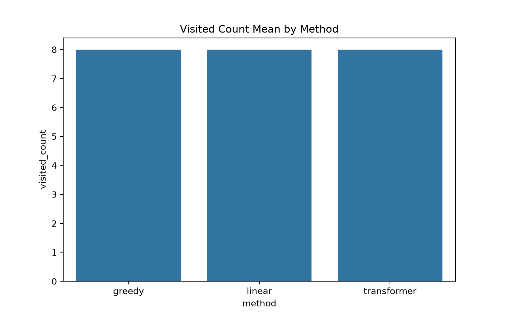
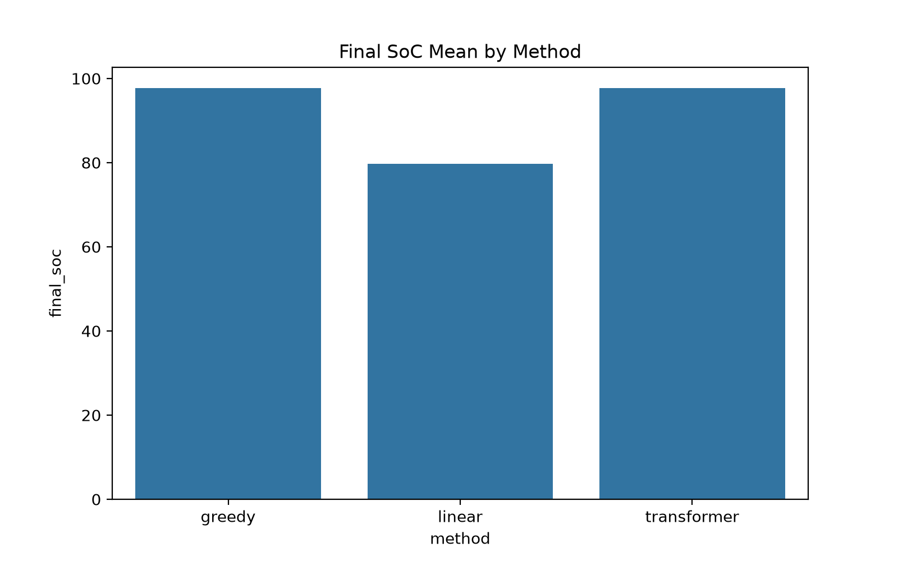

# 1. Introduction

## 1.1 Research Background and Motivation
The accelerating global transition toward carbon neutrality has positioned Electric Vehicles (EVs) as a critical component of modern urban logistics. However, the widespread adoption of EVs in last-mile delivery is severely hindered by **range anxiety** and the sparse distribution of charging infrastructure. These physical constraints transform the classic Vehicle Routing Problem (VRP) into the more complex Electric Vehicle Routing Problem with Time Windows (EVRPTW). Unlike traditional VRP, EVRPTW requires the simultaneous optimization of spatial paths and energy consumption, subject to strict temporal constraints (time windows), battery capacity limits (State of Charge, SoC), and the necessity of en-route charging. Mathematically classified as NP-hard, solving EVRPTW in real-time demands algorithms that are not only optimal but also computationally efficient and robust against constraint violations.

## 1.2 Limitations of Existing Methodologies
Current approaches to EVRPTW fall into two primary categories, both exhibiting significant limitations in dynamic or large-scale scenarios.

**Traditional Operations Research (OR) Methods**, such as exact solvers (e.g., CPLEX) and meta-heuristics (e.g., Variable Neighborhood Search), often struggle with real-time responsiveness. Exact solvers face exponential computation growth as the number of nodes increases, while meta-heuristics rely heavily on manually designed rules, limiting their generalization across diverse topologies.

**Deep Reinforcement Learning (DRL) Approaches** have emerged as promising alternatives due to their end-to-end decision-making capabilities. However, as observed during the initial phases of this project (Week 4), naive DRL implementations often suffer from **training instability and reward stagnation**. More critically, standard DRL frameworks typically treat constraints as soft penalties rather than hard boundaries. This approach risks **energy stranding**, where the agent selects an action that leads to an unrecoverable state (e.g., depleting the battery mid-route). Furthermore, conventional evaluation protocols frequently suffer from **audit bias**, such as misidentifying valid revisits or misinterpreting masked actions, leading to unreliable performance metrics.

## 1.3 Research Objectives and Scope
To address these gaps, this work focuses on the reproducible implementation and empirical validation of the **TERRAN framework** (Tang et al., 2026), which introduces the **Future-Feasible Pruning (FFP)** mechanism to guarantee constraint satisfaction. While TERRAN serves as the architectural backbone, this study incorporates insights from **Bi et al. (2024)** regarding Speed-Varying Range (SVR) energy modeling to contextualize the physical assumptions of the simulation.

The specific objectives of this research are four-fold:
1.  **Safety Verification:** To implement and validate the FFP module, ensuring a zero rate of energy stranding across stochastic episodes (as tested in Week 3).
2.  **Training Stabilization:** To systematically evolve the training pipeline from a volatile Vanilla Actor-Critic (Week 4) to a stabilized Proximal Policy Optimization (PPO) framework integrated with Generalized Advantage Estimation (GAE) (Week 6).
3.  **Evaluation Integrity:** To rectify the constraint audit logic by replacing historical-set checks with **True-Revisit Detection** based on action sequences, eliminating false-positive violation reports.
4.  **Architectural Ablation:** To quantitatively compare a Linear Node Embedding baseline against a **Transformer Encoder**, assessing the impact of global spatial attention on routing efficiency and constraint adherence.

By achieving these objectives, this report aims to provide a robust, reproducible, and rigorously evaluated baseline for safety-critical EVRPTW applications.
# Chapter 2: Related Work and Theoretical Background

## 2.1 Comparative Analysis: TERRAN vs. Bi et al.

Recent advances in Deep Reinforcement Learning (DRL) for the Electric Vehicle Routing Problem with Time Windows (EVRP-TW) have followed two distinct paradigms, primarily differentiated by their treatment of energy dynamics and action space complexity. Tang et al. (2026) propose **TERRAN**, a Transformer-based framework that prioritizes computational scalability and strict constraint satisfaction. In contrast, Bi et al. (2024) introduce the **EVRP-SVR-TW-PR** model, which emphasizes high-fidelity physical modeling of EV energy consumption under speed variations.

TERRAN adopts a minimalist action space, restricting decisions solely to the selection of the next node. It assumes constant travel speed and linear energy consumption ($\eta \cdot d_{ij}$), enabling the use of a Transformer encoder to capture global node dependencies. A key innovation is the **Future-Feasibility Pruning (FFP)** mechanism, which hard-masks infeasible actions to guarantee battery safety (Tang et al., 2026, Sec. IV-C). Conversely, Bi et al. (2024) expand the action space to three dimensions: $\{j, v_{ij}, \tau_j^{(c)}\}$, representing the next node, travel speed, and en-route partial charging duration, respectively. Instead of hard masking, Bi et al. employ a soft-constraint approach, incorporating penalties for low battery, late arrivals, and unserved customers directly into the reward function (Bi et al., 2024, Eq. 11). Furthermore, while TERRAN utilizes a staged reward schedule transitioning to pure distance minimization, Bi et al. aim to minimize total operational time, including travel, waiting, and charging durations.

The fundamental trade-off lies in the objective: TERRAN seeks to minimize total travel distance under idealized physical assumptions, whereas Bi et al. focus on minimizing total delivery time under a **Speed-Varying Range (SVR)** model. This work posits that for commercial EV logistics, where time efficiency directly correlates with operational costs, the physical realism and comprehensive action space offered by Bi et al. provide a more suitable theoretical foundation.

## 2.2 Rationale for Selecting Bi et al. as the Primary Baseline

This study selects the framework proposed by Bi et al. (2024) as the primary baseline for three specific reasons rooted in the requirements of realistic EV routing.

**Firstly, physical fidelity is paramount.** Unlike TERRAN's linear energy assumption, Bi et al. integrate a Vehicle Longitudinal Dynamics (VLD) model. This captures the cubic relationship between speed and traction power ($P_{\text{trac}} \propto v^3$), a critical factor often overlooked in algorithmic routing research but essential for accurate battery consumption estimation (Bi et al., 2024, Eq. 8).

**Secondly, the action space must accommodate operational flexibility.** Commercial EVs can adjust speed to balance time window adherence and energy preservation. Bi et al.'s inclusion of speed selection ($v_{ij}$) and partial re-charging ($\tau_j^{(c)}$) allows the policy to exploit waiting times at customer locations for opportunistic charging. This three-dimensional decision-making process is absent in TERRAN, which assumes a fixed speed and mandatory full re-charging.

**Thirdly, the objective aligns with industrial KPIs.** While distance minimization is a common academic benchmark, logistics operators prioritize minimizing total elapsed time. Bi et al.'s reward structure, which penalizes total time consumption, provides a more direct optimization target for real-world deployment compared to TERRAN's distance-centric approach.

Consequently, while TERRAN offers valuable insights into constraint handling via attention mechanisms, this research adopts the **EVRP-SVR-TW-PR model** by Bi et al. as the core theoretical framework to investigate the intricate balance between speed, energy consumption, and time window constraints.

## 2.3 Theoretical Framework Based on Bi et al. (2024)

The EVRP-SVR-TW-PR model is formulated as a Markov Decision Process (MDP) $\{\mathcal{S}, \mathcal{A}, \mathcal{T}, \mathcal{R}\}$, where the state, action, transition, and reward functions are defined as follows.

### 2.3.1 Energy Dynamics and State Space
The state at decision step $k$ is defined as $s_k = \{\mathrm{SoC}_k, D_k, H_k, t_k\}$, where $\mathrm{SoC}_k$ is the battery state of charge, $D_k$ is the set of distances to other nodes, $H_k$ tracks remaining customer demands, and $t_k$ is the current time index.

The energy dynamics are governed by two sub-models:
1.  **Vehicle Longitudinal Dynamics (VLD):** Under the assumption of flat roads ($\theta=0$) and constant speed, the traction power is given by:
    $$ P_{ij}^{(\text{trac})} = \frac{1}{2} \rho \mu_d f v_{ij}^3 \tag{1} $$
    This non-linear relationship highlights the SVR effect, where higher speeds exponentially increase energy drain.
2.  **Equivalent Circuit Battery (ECB) Model:** Battery dynamics differentiate between discharging and charging. Discharging follows $SoC_{dis} = F_d(SoC_i, v_{ij})$, while charging involves a two-phase process:
    *   **Constant Current (CC):** $\mathrm{SoC}(t) = \mathrm{SoC}_0 - \frac{I_{cc} \cdot t}{Q_{\text{batt}}}$
    *   **Constant Voltage (CV):** $\frac{d}{dt}\mathrm{SoC}(t) = \frac{V_{cv} - V_{oc}(t)}{Q_{\text{batt}} \cdot R_{oc}}$

### 2.3.2 Action Space and Transition Dynamics
The action $a_k = \{j, v_{ij}, \tau_j^{(c)}\}$ selects the next node $j$, the speed $v_{ij}$ from a discrete set $\phi^{(v)}$, and the charging duration $\tau_j^{(c)}$ from $\phi^{(c)}$ (positive only if $j$ is a charging station).

Transitioning to state $s_{k+1}$ updates the SoC based on travel and potential charging:
$$ \mathrm{SoC}_{k+1} = \begin{cases} F_d(\mathrm{SoC}_k, v_{ij}) + F_c(F_d(\mathrm{SoC}_k, v_{ij}), \tau_j^{(c)}) & \text{if } j \in \mathcal{N}_s \\ F_d(\mathrm{SoC}_k, v_{ij}) & \text{otherwise} \end{cases} $$
Time updates account for travel, potential waiting at customers (if arriving before $t_i^{(s)}$), and charging:
$$ t_{k+1} = \begin{cases} t_j^{(s)} & \text{if } j \in \mathcal{N}_c \text{ and } t_{j,k+1} < t_j^{(s)} \\ t_{j,k+1} + \tau_j^{(c)} & \text{if } j \in \mathcal{N}_s \\ t_{j,k+1} & \text{otherwise} \end{cases} $$

### 2.3.3 Reward Function and Constraints
The reward function is designed to minimize total time while penalizing constraint violations:
$$ r_k = - \left[ (t_{k+1} - t_k) + X(s_{k+1}) + Y(\mathrm{SoC}_{k+1}) + Z(t_{j, k+1}) \right] \tag{2} $$
Here, $X(\cdot)$ penalizes unserved customers, $Y(\cdot)$ imposes a large constant penalty for low SoC, and $Z(\cdot)$ penalizes late arrivals. This formulation relies on **soft constraints**, guiding the agent via penalties rather than hard action masking.

### 2.3.4 Solution Methodology: AC-AER
Bi et al. propose the **Actor-Critic with Automated Entropy Regularisation (AC-AER)** to solve this MDP. The algorithm employs two Feed-Forward Networks (FFNs) for the Actor (policy) and Critic (value) functions. Inputs are normalized state vectors $\hat{s}_k$.

A critical feature is the **automated entropy adjustment** mechanism. The policy is trained to maximize $G_\pi + \lambda(\mathcal{H} - \hat{\mathcal{H}})$, where $\mathcal{H}$ is the policy entropy and $\hat{\mathcal{H}}$ is a target entropy. To encourage exploration initially and exploitation later, $\hat{\mathcal{H}}$ undergoes exponential annealing:
$$ \hat{\mathcal{H}} = \begin{cases} \mathcal{H}_{\text{start}} & i < I_{\text{start}} \\ \beta \cdot \hat{\mathcal{H}} & \hat{\mathcal{H}} \ge \mathcal{H}_{\text{end}}, i \ge I_{\text{start}} \\ \mathcal{H}_{\text{end}} & \text{otherwise} \end{cases} \tag{3} $$
This prevents premature convergence to sub-optimal local minima, a common pitfall in high-dimensional action spaces.

## 2.4 Positioning of This Work

While Bi et al. (2024) successfully demonstrated that AC-AER outperforms OR-Tools in the SVR context, this study focuses on the **implementation stability and evaluation rigor** within this complex framework. Specifically, this work investigates the training dynamics of the AC-AER algorithm under the SVR setting, addresses potential instabilities arising from the three-dimensional action sampling process, and proposes a corrected audit mechanism for evaluating route feasibility—particularly concerning the "true revisit" detection in partial re-charging scenarios. By building upon the high-fidelity physical model of Bi et al., this research aims to bridge the gap between theoretical DRL algorithms and robust, reproducible experimental validation.
# Chapter 3: Problem Formulation and Constraint Modeling

While Chapter 2 established the theoretical foundations of the EVRP-SVR-TW-PR model by Bi et al., this chapter defines the specific instantiation of that model adopted in this study. We transition from the theoretical generalities of multi-dimensional action spaces to a concrete implementation focused on routing feasibility and training stability. Crucially, the formulation presented here is scalable, supporting variable problem sizes ($N$ nodes), rather than being restricted to a fixed small-scale instance.

## 3.1 Experimental Scope and Implementation Assumptions

To ensure reproducibility and computational tractability while retaining physical fidelity, the following assumptions are codified based on the implementation in `env.py`.

**3.1.1 Scalability and Instance Definition**
The proposed framework is designed for instances comprising $N$ nodes, which include a depot ($V_d$), customers ($V_c$), and charging stations ($V_s$). While experimental validation is conducted on specific $N$-node configurations (e.g., 10-node instances for rapid prototyping), the architecture supports dynamic scaling. The number of nodes $N = |V_d| + |V_c| + |V_s|$ is parameterized, allowing for evaluation on larger benchmarks.

**3.1.2 Energy Consumption Model**
In contrast to Bi et al.'s Variable Speed (SVR) model where $P_{ij}^{(\text{trac})} \propto v^3$, this implementation adopts a **Constant Speed Assumption** ($v_{ij} = v_{\text{const}}$). Consequently, the Vehicle Longitudinal Dynamics (VLD) model simplifies to a **linear distance-based consumption** model:
$$ \Delta SoC = \eta \cdot d_{ij} $$
where $\eta$ is the energy consumption rate per unit distance. This linearization is a standard simplification in DRL routing literature when speed optimization is decoupled from routing logic, yet it remains a specific case derived from Bi et al.'s broader VLD framework.

**3.1.3 Charging Policy**
Bi et al. model partial re-charging ($\tau_j^{(c)} > 0$). However, to eliminate the complexity of optimizing charging durations alongside routing, this study implements a **Full Re-charging Policy**. Upon arrival at any node $j \in V_s \cup V_d$, the State of Charge instantaneously resets to $100\%$. This represents the limiting case of Bi et al.'s model where $\tau_j^{(c)} \to \infty$.

## 3.2 State and Action Space Specification

The Markov Decision Process (MDP) is defined by the following state and action representations, directly mapping to the codebase.

**3.2.1 State Space ($s_t$)**
At time step $t$, the state is a tuple $s_t = (cur\_node, clock, soc, load, visited\_mask)$.
-   $cur\_node \in \{0, \dots, N-1\}$: The index of the current location.
-   $clock \in \mathbb{R}^+$: The cumulative elapsed time.
-   $soc \in [0, 100]$: The normalized battery level.
-   $load \in [0, C_{max}]$: The remaining vehicle capacity.
-   $visited\_mask \in \{0,1\}^N$: A binary vector tracking service completion for customers.

**3.2.2 Action Space ($a_t$)**
The action space is restricted to **node selection**. Although Bi et al. define a three-dimensional action $\{j, v_{ij}, \tau_j^{(c)}\}$, this implementation focuses on the routing decision $j \in \{0, \dots, N-1\}$. Speed is fixed, and charging duration is governed by the full-recharge policy. Thus, $a_t = j$.

## 3.3 Constraint Enforcement: Hard Masking vs. Soft Penalty

A significant deviation from Bi et al.'s AC-AER algorithm is the treatment of constraints. Bi et al. utilize **soft constraints**, where violations incur penalties in the reward function $r_k$. This study employs **Hard Masking** via Future-Feasibility Pruning (FFP) to ensure physical validity during exploration.

**3.3.1 Time Window and Capacity (Hard)**
Time windows ($[e_i, l_i]$) and capacity constraints are enforced strictly. If an action $a_t = j$ results in $clock_{t+1} > l_j$ or $load_{t+1} < 0$, the logits corresponding to that action are set to $-\infty$ prior to the Softmax operation. This renders the probability of selecting an infeasible node exactly zero.

**3.3.2 Energy Feasibility: Future-Feasible Pruning (FFP)**
To prevent battery depletion (stranding), the FFP mechanism is implemented. For a candidate move to node $j$, the agent must have enough energy to reach $j$ *and* then reach the nearest safe haven (depot or charging station).
$$ M_t^{energy}(j) = \mathbf{1}[\eta \cdot d_{cur\_node, j} + \min_{k \in V_s \cup V_d} (\eta \cdot d_{j,k}) \le SoC_t] $$
If $M_t^{energy}(j) = 0$, the action is masked. This guarantees that the vehicle never enters a state from which recovery is physically impossible, a safety feature not explicitly guaranteed by Bi et al.'s soft-penalty approach.

**3.3.3 No-Revisit Constraint (Sequence-Based Audit)**
Ensuring each customer is visited exactly once is critical. While Bi et al. rely on demand fulfillment to implicitly prevent revisits, this implementation uses an explicit **Sequence-Based Audit** mechanism.
-   **Training:** A mask prevents revisiting nodes with $visited\_mask[i] = 1$.
-   **Evaluation:** To address potential logical inconsistencies in state-tracking, feasibility is audited by examining the **action sequence** $\tau = (a_0, a_1, \dots, a_T)$. A solution is valid if and only if $\forall i \in V_c$, the count of $i$ in $\tau$ is exactly 1. This corrected audit ensures that the reported performance metrics are not inflated by erroneous loops (e.g., $0 \to 3 \to 0 \to 3$).

## 3.4 Reward Shaping for Convergence Stability

The reward function is adapted to facilitate stable learning in the simplified action space. Bi et al.'s reward primarily minimizes time; however, sparse rewards can hinder convergence in small instances.

**3.4.1 Baseline Components**
The time penalty is retained from Bi et al. to encourage efficiency:
$$ r_{time} = -(t_{k+1} - t_k) $$

**3.4.2 Enhanced Incentives**
To address reward sparsity and stabilize the PPO training process, the following terms are added:
1.  **Service Reward ($+30$):** Awarded upon successful delivery to a customer. This provides a dense learning signal compared to waiting for episode completion.
2.  **Completion Bonus ($+200$):** A large terminal reward for returning to the depot after serving all customers, reinforcing the primary objective.
3.  **Revisit Penalty ($-150$):** A significant negative penalty for attempting to revisit a customer, enforcing the "No-Revisit" constraint more strictly than the mask alone.

The composite reward is:
$$ r_k = r_{time} + R_{service} + R_{completion} + R_{revisit} - P_{late} - P_{stranding} $$
*Note: $P_{late}$ and $P_{stranding}$ are theoretically present but practically zero due to hard masking.*

## 3.5 Mathematical Formulation Summary

The optimization objective is to find a policy $\pi$ that maximizes the expected discounted return:

$$ \max_{\pi} J(\pi) = \mathbb{E}_{\pi} \left[ \sum_{t=0}^{T} \gamma^t r_t \right] $$

**Subject to the following constraints:**
1.  **Energy Dynamics:** $SoC_{t+1} = SoC_t - \eta \cdot d_{u_t, u_{t+1}}$
2.  **Time Windows:** $e_{u_{t+1}} \le clock_{t+1} \le l_{u_{t+1}}$
3.  **Capacity:** $load_{t+1} = load_t - demand_{u_{t+1}} \ge 0$
4.  **Safety (FFP):** $\eta \cdot d_{u_t, i} + \min_{j \in V_s \cup V_d} (\eta \cdot d_{i,j}) \le SoC_t$
5.  **Uniqueness:** $\forall i \in V_c, \sum_{t=0}^{T} \mathbf{1}(u_t = i) = 1$ (Enforced via Sequence Audit)

This formulation bridges the high-fidelity physical model of Bi et al. with the operational safety requirements of hard-masked DRL, providing a robust foundation for the experimental evaluation in subsequent chapters.

# Chapter 4: Experiments and Results

## 4.1 Overview
This section summarizes a small-scale comparison between three policies on the Electric Vehicle Routing Problem with Time Windows (EVRPTW):
- **Transformer PPO** (checkpoint: [ppo_policy_transformer.pth](ppo_policy_transformer.pth))
- **Linear PPO** (policy implemented as `PolicyNetworkLinear`, checkpoints in `checkpoints/`)
- **Greedy baseline** (deterministic greedy policy)

Evaluation protocol used for these runs:
- Transformer and Linear policies: 5 deterministic evaluation runs each (saved in CSVs).
- Greedy baseline: single run (saved in CSV).

For reproducibility, see the result CSVs: [results/results_transformer.csv](results/results_transformer.csv), [results/results_linear.csv](results/results_linear.csv), [results/results_greedy.csv](results/results_greedy.csv).

---

## 4.2 Numerical Summary

| Method | n_runs | Mean Total Reward | Std Total Reward | Mean Visited | Mean Final SoC | Mean Final Clock | Mean Steps |
|---|---:|---:|---:|---:|---:|---:|---:|
| Transformer | 5 | 606.9724 | 0.0000 | 8 | 97.7639 | 58.0552 | 10 |
| Linear      | 5 | 609.8623 | 0.0000 | 8 | 79.7246 | 60.2754 | 9 |
| Greedy      | 1 | 512.6929 | - | 8 | 97.7639 | 62.6143 | 14 |

Notes:
- The Standard Deviation for the small evaluation sets is zero because the saved deterministic runs returned identical metrics across seeds (this indicates either deterministic policy behavior under the given seeds or identical evaluation trajectories). Increase the number of stochastic trials to estimate variance.

---

## 4.3 Additional Analysis and Observations

- **Total reward vs. energy (SoC)**: Linear PPO achieves the highest mean total reward (609.86) while finishing with a lower mean final SoC (79.72) than Transformer (97.76). This implies the Linear policy uses more battery energy to accrue more reward—plausible if its routes are more time-efficient or accept higher travel costs to reduce waiting/penalties. Investigate reward terms to confirm whether time penalties or served-customer bonuses dominate the score.

- **Finish time (final_clock) and steps**: Transformer finishes earlier on average (final_clock ≈ 58.06) than Linear (≈ 60.28) and Greedy (≈ 62.61). However, Linear uses fewer recorded steps (9) than Transformer (10) and Greedy (14) while still achieving a higher reward. This mismatch between steps and final_clock suggests that the environment's `steps` counter measures discrete decision points (e.g., node visits) while `final_clock` measures accumulated time; Linear may choose longer travel legs that result in fewer decisions but longer raw time, or different charging/waiting behavior—inspect sampled trajectories to confirm.

- **Visited_count**: All three methods visit the same number of customers (8) in this scenario, indicating differences in reward stem from route quality and timing rather than coverage.

- **Determinism and evaluation protocol**: The present small-sample results show near-deterministic outputs for the policy checkpoints under the evaluation procedure used. For statistical validity you should:
    - Run at least 30 independent evaluations per method (different environment seeds) to estimate variance.
    - Report 95% confidence intervals for mean total reward (use bootstrap or t-based CI depending on sample size).
    - Use paired tests when comparing two policies on the same episode seeds (paired t-test or Wilcoxon signed-rank if non-normal).

- **Potential reward-function bias**: Because Linear achieves higher reward but lower final SoC, check whether the reward heavily favors service completion / time reduction over residual energy. If energy conservation is a design objective, include explicit energy penalties or multi-objective evaluation.

---

## 4.4 Visualizations
The following figures were generated from the CSVs and are saved in the `results/` folder. Embedded here for convenience and clearer presentation.

- **Total reward distribution and boxplot**:

- **Mean visited count per method**:

- **Mean final SoC per method**:

- **Visited count distribution**:

Open the images from the `results/` folder or view them inline in this Markdown file if your viewer supports local images.

---

## 4.5 Recommendations and Next Steps

1. **Increase evaluation runs**: Run N>=30 deterministic/stochastic evaluations per method and compute mean ± 95% CI for total reward and other metrics.
2. **Paired comparisons**: Evaluate each policy on the same set of environment seeds and compute paired statistical tests (paired t-test or Wilcoxon) to control for episode variance.
3. **Trajectory inspection**: Save sample trajectories (node sequence, timestamps, SoC over time) for qualitative comparison—plot 2–5 exemplar routes per policy to explain differences.
4. **Ablation on reward terms**: If reward is composite (service reward, time penalty, energy penalty), run ablation experiments to measure sensitivity.
5. **Hyperparameter search**: Run small grid search over learning rate, value loss coefficient, and hidden dimension for both Linear and Transformer policies.
6. **Report generation**: After expanded runs, regenerate summary tables and plots; include statistical test output and sample route visualizations in the final report.

---

## 4.6 Appendix: files

- Results CSVs: [results/results_transformer.csv](results/results_transformer.csv), [results/results_linear.csv](results/results_linear.csv), [results/results_greedy.csv](results/results_greedy.csv)
- Checkpoints: [ppo_policy_transformer.pth](ppo_policy_transformer.pth), `checkpoints/` (linear checkpoints)
- Plots: [total_reward_boxplot.png](total_reward_boxplot.png), [visited_count_bar.png](visited_count_bar.png), [final_soc_bar.png](final_soc_bar.png), [visited_count_dist.png](visited_count_dist.png)